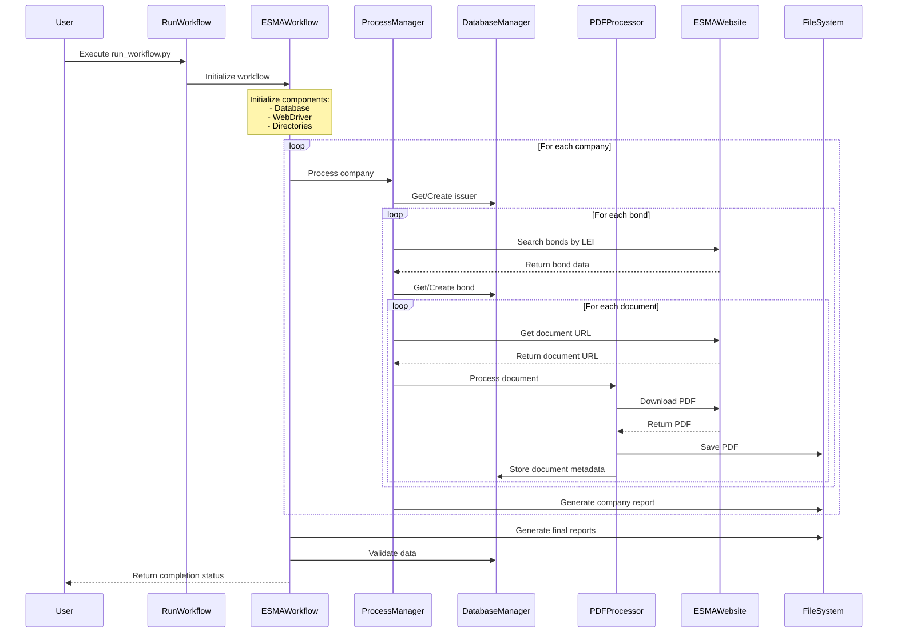
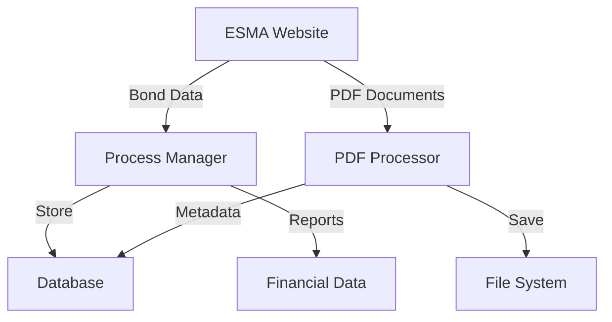

# ESMA Data Collection Workflow

## Sequence Diagram

## Component Interactions

### 1. Initialization Phase
- User runs `run_workflow.py`
- `ESMAWorkflow` initializes all components
- Sets up database, WebDriver, and directories

### 2. Company Processing Phase
- For each company in configuration:
  1. Get/Create issuer in database
  2. Search for bonds on ESMA website
  3. Process each bond found

### 3. Bond Processing Phase
- For each bond:
  1. Validate bond data
  2. Store in database
  3. Collect associated documents

### 4. Document Processing Phase
- For each document:
  1. Download PDF from ESMA
  2. Save to file system
  3. Store metadata in database

### 5. Reporting Phase
- Generate company-specific reports
- Create final workflow summary
- Validate collected data

## Data Flow

## Component Responsibilities

### RunWorkflow
- Entry point
- Error handling
- Process initialization

### ESMAWorkflow
- Main workflow orchestration
- Component coordination
- Status tracking

### ProcessManager
- Company processing
- Bond data collection
- Report generation

### DatabaseManager
- Data persistence
- Record management
- Data validation

### PDFProcessor
- Document downloading
- PDF processing
- File management

### FileSystem
- PDF storage
- Report storage
- Data organization 